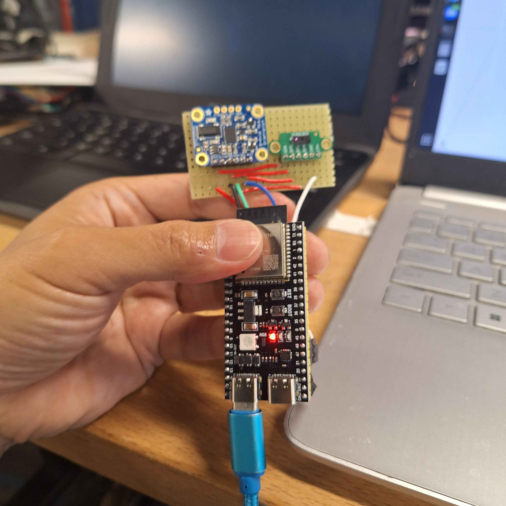

# VL53L5CX-BNO08X-viewer

Real-time 3D point cloud viewer for the VL53L5CX multi-zone time-of-flight sensor with BNO055 IMU orientation tracking.

[](https://youtu.be/s32OUzhjf4U)

> **Note:** This setup targets an **ESP32-S3** (native USB) with a **BNO055** IMU.
> See [Porting notes](#porting-notes-esp32-s3--bno055) for the changes from the
> original classic-ESP32 / BNO08x design.

## Features

- **64-zone 3D visualization** - See the VL53L5CX's 8x8 measurement grid as rays in 3D space
- **Real-time IMU tracking** - BNO055 orientation rotates the virtual view to match physical movement
- **Zero Orientation** - Capture any pose as "neutral" so rotation works regardless of IMU mounting
- **Temporal filtering** - Exponential moving average smooths noisy measurements
- **Plane fitting** - Least squares and RANSAC methods for surface detection
- **Mapping mode** - Accumulate points over time to build a 3D map of your environment

## Hardware

**Components (from AliExpress):**
- ESP32-S3 dev board ([ESP32-S3 DevKit](https://www.oceanlabz.in/esp32-s3-devkit-pinout-reference/))
- VL53L5CX ToF sensor
- BNO055 IMU

**Sensor layout:**



Mount the **BNO055 IMU** and the **VL53L5CX ToF sensor** side-by-side and
**coplanar, facing the same direction** (as shown above). The viewer assumes the
two sensors share an orientation, so keep their boards aligned. To set the
"forward" reference, point the rig straight ahead and level and click **Calibrate
Forward** in the viewer.

**Wiring (ESP32-S3):**

| VL53L5CX | ESP32-S3 |
| -------- | -------- |
| VIN      | 3V3      |
| GND      | GND      |
| SDA      | GPIO 21  |
| SCL      | GPIO 47  |
| LPn      | GPIO 48  |

| BNO055   | ESP32-S3 |
| -------- | -------- |
| VIN      | 3V3      |
| GND      | GND      |
| SDA      | GPIO 21  |
| SCL      | GPIO 47  |

Both sensors share the I2C bus (same SDA/SCL pins). The firmware expects the
BNO055 at I2C address `0x28` (the default). Some breakouts default to `0x29`,
which collides with the VL53L5CX — strap the ADR pin low to select `0x28`.

> **ESP32-S3 pin choice:** GPIO19/20 are the native USB D-/D+ lines and GPIO22
> does not exist on the S3, so the classic-ESP32 I2C pins can't be reused. SCL and
> LPn are therefore on GPIO47/48. If you wire to different pins, update `SDA_PIN`,
> `SCL_PIN`, and `LPN_PIN` in `firmware/vl53l5cx_reader/vl53l5cx_reader.ino` — just
> avoid GPIO19/20 and the flash/PSRAM pins (26-37).

## Installation

### ESP32 Firmware

Install the ESP32 board support package and the sensor libraries (using
[`arduino-cli`](https://arduino.github.io/arduino-cli/)):

```bash
# Board support package (one-time)
arduino-cli core install esp32:esp32

# Libraries (Adafruit BNO055 pulls in Adafruit BusIO + Unified Sensor)
arduino-cli lib install "SparkFun VL53L5CX Arduino Library"
arduino-cli lib install "Adafruit BNO055"
```

Build and flash. The S3 uses native USB, so the FQBN includes the USB-CDC options,
and the board must be in **download mode** to receive the flash:

```bash
# Compile
arduino-cli compile --fqbn esp32:esp32:esp32s3:USBMode=default,CDCOnBoot=cdc firmware/vl53l5cx_reader

# Enter download mode first: hold BOOT, tap RESET, release BOOT
arduino-cli upload --fqbn esp32:esp32:esp32s3:USBMode=default,CDCOnBoot=cdc -p /dev/ttyACM0 firmware/vl53l5cx_reader
```

After flashing, **tap RESET once** to start the application. The board enumerates
as `/dev/ttyACM0` on Linux (native USB CDC, `303a:` VID).

> **Troubleshooting:**
> - *`No serial data received` on upload* — the board isn't in download mode. Hold
>   BOOT, tap RESET, release BOOT, then retry.
> - *No data after flashing* — tap RESET to launch the app; the auto-reset over
>   native USB is unreliable.
> - *`libstdc++.so.6` error when compiling* — the snap build of `arduino-cli` is
>   sandboxed and can't reach the 32-bit toolchain libs. Use the standalone
>   `arduino-cli` binary from the official site instead of the snap.

### Python Viewer

The viewer is managed with [uv](https://docs.astral.sh/uv/):

```bash
# Create the virtual environment (Python 3.10+) and install dependencies
uv venv
uv pip install -r viewer/requirements.txt
```

## Usage

```bash
uv run python -m viewer --port /dev/ttyACM0
# or, with the venv activated / directly:
.venv/bin/python -m viewer --port /dev/ttyACM0
```

Open http://localhost:8081 in your browser.

**Options:**
- `--port`, `-p`: Serial port (default: `/dev/cu.usbserial-0001`; use `/dev/ttyACM0` on Linux)
- `--baud`, `-b`: Baud rate (default: `115200`)
- `--viser-port`: Viser server port (default: `8081`)
- `--debug`: Enable verbose logging

**Setting the orientation reference:** with **Apply IMU Rotation** enabled, hold the
sensor in whatever pose you want to be "neutral" and click **Zero Orientation**. The
view then tracks rotation relative to that pose — this replaces the old hard-coded
frame correction and works with any IMU mounting.

## Sensor Specs

**VL53L5CX** ([datasheet](https://www.st.com/resource/en/datasheet/vl53l5cx.pdf)):
- **FoV:** 65° diagonal
- **Range:** 20mm - 4000mm
- **Distance type:** Perpendicular (z-axis), not radial

| Resolution | Zones | Max Frequency |
| ---------- | ----- | ------------- |
| 4x4        | 16    | 60 Hz         |
| 8x8        | 64    | 15 Hz         |

Currently configured for 8x8 at 15Hz.

> **I2C speed:** The bus runs at 400kHz because that is the BNO055's maximum. The
> VL53L5CX prefers 1MHz for 8x8 — if you see dropped ToF frames, lower the ranging
> frequency or switch to 4x4 in the firmware.

## Serial Protocol

The ESP32 streams JSON over serial at 115200 baud:

```json
{"distances":[d0,d1,...,d63],"status":[s0,s1,...,s63],"quat":[w,x,y,z],"v":"0.1.0"}
```

- `distances`: 64 values in mm (perpendicular distance)
- `status`: 64 values (5 = valid measurement)
- `quat`: IMU quaternion (w, x, y, z)
- `v`: firmware version (must match `config.VERSION` in the viewer)

Zones are row-major: 0-7 = row 0, 8-15 = row 1, etc.

## Porting notes (ESP32-S3 + BNO055)

Changes from the original classic-ESP32 / BNO08x project:

**Hardware / GPIO**
- I2C SCL moved from GPIO22 → **GPIO47**, VL53L5CX LPn from GPIO19 → **GPIO48**
  (GPIO19/20 are USB on the S3, GPIO22 doesn't exist). SDA stays on GPIO21.

**Firmware** (`firmware/vl53l5cx_reader/vl53l5cx_reader.ino`)
- Swapped the SparkFun BNO08x library for **Adafruit BNO055**, running in
  **IMUPLUS** mode (accel + gyro fusion, no magnetometer). The IMU object is named
  `bno` (the library defines an `imu` namespace).
- Orientation is read by polling `bno.getQuat()` each loop.
- I2C bus clock lowered to **400kHz** (BNO055 maximum).
- Built for the S3's native USB: `USBMode=default` (USB-OTG/TinyUSB), `CDCOnBoot=cdc`.

**Viewer** (`viewer/`)
- Added the **Zero Orientation** button; orientation is now shown relative to a
  captured reference pose instead of the old fixed `correct_imu_to_tof_frame`
  correction (`viewer/viewer.py`).
- Default Viser port changed to **8081**.

## License

MIT
